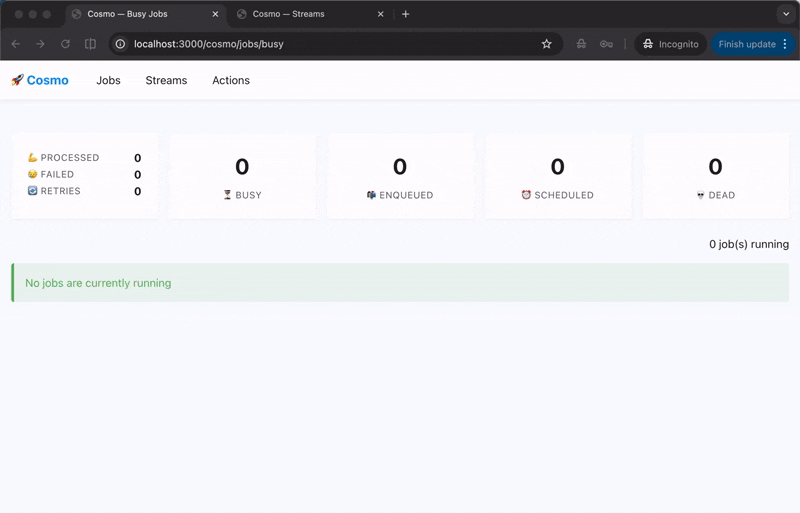

# 🚀 Cosmonats

Background jobs + real-time event streaming for Ruby — unified, in one gem, backed by NATS.  
**No Redis. No DB polling. Disk-backed, horizontally scalable — no message is ever silently dropped.**

<div align="center">


[](https://rubygems.org/gems/cosmonats)
[](https://rubygems.org/gems/cosmonats)
[](https://www.ruby-lang.org)
[](LICENSE.txt)
[](https://github.com/bitsbeam/cosmonats/actions)

*Battle-tested in production. Tens of millions of jobs processed and counting.*

</div>


## ⚡ Taste it

```ruby
# Define a job with a familiar look
class SendEmailJob
  include Cosmo::Job
  options stream: :default, retry: 3, dead: true

  def perform(user_id, template)
    EmailService.send(user_id, template)
  end
end

# Enqueue it
SendEmailJob.perform_async(123, "welcome")
SendEmailJob.perform_in(1.day, 123, "followup")
```

```ruby
# Process a continuous real-time event stream
class ClicksProcessor
  include Cosmo::Stream
  options stream: :clickstream, batch_size: 100,
          consumer: { subjects: ["events.clicks.>"] }

  def process_one
    Analytics.track(message.data)
    message.ack
  end
end

ClicksProcessor.publish({ user_id: 123, page: "/home" }, subject: "events.clicks.homepage")
```

```bash
bundle exec cosmo -C config/cosmo.yml -c 20         # Run jobs + streams with 20 threads
bundle exec cosmo -C config/cosmo.yml -c 20 jobs    # Jobs only
bundle exec cosmo -C config/cosmo.yml -c 20 streams # Streams only
```



## 📖 Index

- [Why?](#-why)
- [Features](#-features)
- [Installation](#-installation)
- [Quick Start](#-quick-start)
- [Core Concepts](#-core-concepts)
  - [Jobs](#jobs)
  - [Streams](#streams)
  - [Configuration](#configuration)
- [Advanced Usage](#-advanced-usage)
  - [Cron](#cron)
  - [Priority Queues](#priority-queues)
  - [Batches](#batches)
  - [Concurrency Limiting](#concurrency-limiting)
  - [Custom Serializers](#custom-serializers)
  - [Error Handling](#error-handling)
  - [Testing](#testing)
  - [Integrations](#integrations)
- [CLI Reference](#-cli-reference)
- [Deployment](#-deployment)
- [Monitoring](#-monitoring)
- [Examples](#-examples)


## 🎯 Why?

Most background job libraries use Redis or Postgres — tools that were never designed for this. Think of NATS as Redis — but Redis is KV first then messaging;
NATS is messaging first, then KV. What NATS is:

- **~20 MB binary, ~10 MB RAM at idle** Trivial to run anywhere.
- **Disk-backed persistent streams** Messages survive restarts, don't require RAM to fit.
- **True horizontal clustering** Lose a node — other nodes take over, zero message loss.
- **Multilingual** Official clients for Ruby, Go, Python, Rust, Java, .NET, and more. Any service can publish or consume.

One NATS server replaces your message broker, job queue, and KV store — with lower operational overhead.

|                   | Redis/DB-backed               | NATS/Cosmonats             |
|-------------------|-------------------------------|----------------------------|
| Persistence       | In-memory / DB bloat          | Disk-backed, TB-scale      |
| Scaling           | Sentinel only / Vertical only | True horizontal clustering |
| Background jobs   | Yes                           | Yes                        |
| Real-time stream  | No                            | Yes                        |
| Zero message loss | No                            | Yes                        |
| Message replay    | No                            | Yes                        |
| Backpressure      | No, grow unbounded            | Yes                        |
| Multi-DC          | Complex setup                 | Native geo-distribution    |


### Killer Features:

#### — Jobs + Streams, unified in one gem.

Most Ruby gems handle exactly that — background jobs. If you also need to consume a continuous event feed, that's a second system, second config, second set of
worker processes, second Dockerfile entry. Cosmonats is the only Ruby gem with a first-class `Job` primitive *and* a first-class `Stream` primitive, sharing
one server, one config, one CLI, one monitoring endpoint.

#### — Message replay and time-travel debugging.

NATS persists messages to disk and lets any consumer rewind to any point — beginning of time, a specific timestamp, or only new messages.
- **Incident recovery** — your pipeline crashed for 3 hours. Replay from the crash timestamp.
- **New consumer bootstrap** — a new service needs historical events. Start it from the beginning.
- **Bug reproduction** — replay the exact sequence of messages that caused a production issue.

#### — Multi-datacenter queues, natively.

NATS has a first-class cluster + leaf-node architecture for geo-distribution. Spanning multiple regions or datacenters is a config block — not a separate
product or a third-party replication tool. NATS was built for edge computing, IoT, and satellite communication — multi-DC is a first-class concern, not an
afterthought.

#### — Transport-level deduplication + built-in KV. No extra infrastructure.

NATS deduplicates messages at the **broker** — same-ID messages within the configured window are dropped before they ever reach a worker. No uniqueness gems,
no advisory locks, no extra round-trips. It also ships a built-in Key/Value store usable for distributed locks and rate limiting — no Redis, no Memcached,
nothing else to run.


## ✨ Features

### 🎪 Job Processing
- **Familiar API** — `perform_async`, `perform_in`, `perform_at`
- **Priority queues** — critical, high, default, low with weighted round-robin
- **Scheduled jobs** — execute at a specific time or after a delay
- **Automatic retries** — exponential backoff, configurable attempts
- **Dead letter queue** — capture permanently failed jobs
- **Job uniqueness** — prevent duplicate execution
- **Concurrency limits** — cap simultaneous executions per class or per key
- **Cron scheduling** — recurring jobs manageable live from the web UI
- **Batches** — group jobs and fire a callback once the whole group finishes, including nested batches

### 🌊 Stream Processing
- **Real-time event streams** — process continuous data feeds
- **Batch processing** — handle multiple messages in one go
- **Message replay** — reprocess from any point in time
- **Consumer groups** — load-balanced across workers
- **Custom serialization** — JSON, MessagePack, Protobuf
- **Pause / resume** — stop and restart a stream's processing without losing its position


## 📦 Installation

```ruby
# Gemfile
gem "cosmonats"
```

**Requirements:** Ruby ≥ 3.1, NATS Server ([install guide](https://docs.nats.io/running-a-nats-service/introduction/installation))

Spin up NATS instantly with Docker — one command, that's it:
```bash
docker run -p 4222:4222 -p 8222:8222 nats:alpine -js
```

Or add it to your existing `docker-compose.yml`:
```yaml
services:
  nats:
    image: nats:alpine
    command: -js
    ports:
      - "4222:4222"
      - "8222:8222"
```

Mount the monitoring UI in your Rack app:
```ruby
require "cosmo/web"

# Rails
mount Cosmo::Web => "/cosmo"

# Any Rack app (config.ru)
map "/cosmo" { run Cosmo::Web }
```


## 🚀 Quick Start

### 1. Create `config/cosmo.yml`

```yaml
concurrency: 5                     # Number of worker threads

consumers:                         # Declare consumer groups for streams, things that pull messages and process them
  jobs:                            # Consumer configs for jobs (or streams)
    default:                       # Stream name
      ack_policy: explicit         # Acknowledgment required for each message can be explicit, none, or all
      max_deliver: 30              # Max retry attempts before sending to a dead stream. Safety ceiling only, keep it above every job class's own retry
      max_ack_pending: 10          # Max messages waiting for ack, if exceeded, the server will stop delivering new messages until some are acked
      ack_wait: 15                 # Seconds to wait for ack before redelivering
      subject: jobs.%{name}.>      # Subject pattern for this consumer, %{name} replaced with stream name, becomes `jobs.default.>`

setup:                             # Initial stream creation only `cosmo -S`
  jobs:                            # Stream configs for jobs (or streams)
    default:                       # Stream name
      storage: file                # Storage type (file or memory)
      retention: workqueue         # Retention policy (limits, interest, workqueue). workqueue - deletes acked/nacked, limits - append only
      subjects: ["jobs.%{name}.>"] # Subject pattern for this stream, %{name} replaced with stream name
      allow_direct: true           # Allow direct messages to stream (required for web UI)
```

### 2. Create streams in NATS (one-time), grabs config from setup section of `config/cosmo.yml`

```bash
bundle exec cosmo -S
```

### 3. Define a job in `app/jobs/`

```ruby
class SendEmailJob
  include Cosmo::Job
  options stream: :default, retry: 3, dead: true

  def perform(user_id, email_type)
    UserMailer.send(email_type, user_id).deliver_now
  end
end
```

### 4. Enqueue & run

```ruby
SendEmailJob.perform_async(42, "welcome")
```

```bash
bundle exec cosmo -C config/cosmo.yml -c 10 -r ./app/jobs jobs
```


## 💡 Core Concepts

### Jobs

```ruby
class ReportJob
  include Cosmo::Job

  options(
    stream: :critical,  # Stream name
    retry: 5,           # Retry attempts
    dead: true          # Send to dead letter queue on final failure
  )

  def perform(report_id)
    logger.info "Processing report #{report_id}"
    Report.find(report_id).generate!
  rescue StandardError => e
    logger.error "Failed: #{e.message}"
    raise  # Triggers retry with exponential backoff
  end
end

ReportJob.perform_async(42)                              # Enqueue now
ReportJob.perform_in(30.minutes, 42)                     # Delayed
ReportJob.perform_at(Time.parse("2026-01-25 10:00"), 42) # Scheduled
ReportJob.perform_sync(42)                               # Inline, no NATS (great for tests)
```

### Streams

```ruby
class ClicksProcessor
  include Cosmo::Stream

  options(
    stream: :clickstream,
    batch_size: 100,
    start_position: :last,  # :first, :last, :new, or timestamp
    consumer: {
      ack_policy: "explicit",
      max_deliver: 3,
      max_ack_pending: 100,
      subjects: ["events.clicks.>"]
    }
  )

  # Process one message at a time
  def process_one
    Analytics.track_click(message.data)
    message.ack
  end

  # OR process a batch
  def process(messages)
    Analytics.bulk_track(messages.map(&:data))
    messages.each(&:ack)
  end
end

# Publishing
ClicksProcessor.publish({ user_id: 123, page: "/home" }, subject: "events.clicks.homepage")

# Acknowledgment strategies
message.ack                          # Success
message.nack(delay: 5_000_000_000)   # Retry in 5 seconds (nanoseconds)
message.term                         # Permanent failure, no retry
```

### Configuration

**NATS subjects** follow a dot-separated hierarchy (`events.clicks.homepage`).
The `>` wildcard matches everything after that prefix. Think of subjects as topic names — flexible routing with no extra configuration.

**Full `config/cosmo.yml` example:**
```yaml
timeout: 25                 # Shutdown timeout in seconds
concurrency: &concurrency 1 # Number of worker threads
max_retries: &max_retries 3 # Default max retries
batch_expiry: 259200         # Seconds before a Batch's tracking data expires (default: 3 days)

stream_config: &stream_config
  storage: file         # storage type (file or memory)
  retention: workqueue  # retention policy (limits, interest, workqueue)
  duplicate_window: 120 # time window for duplicate message detection in seconds
  discard: old          # discard new messages when stream is full (discard new or old)
  allow_direct: true    # allow direct messages to stream, required for web UI
  subjects:
    - jobs.%{name}.>    # subject pattern for stream, %{name} will be replaced with stream name

consumer_config: &consumer_config
  ack_policy: explicit    # ack policy (explicit, none, all), each individual message must be acknowledged
  max_deliver: 30         # maximum number of times a message will be delivered before it's considered failed. keep it above every job class's own retry; a job that still exceeds it is capped and dead-lettered early with a warning
  max_ack_pending: 20     # maximum number of messages with pending ack for this consumer
  ack_wait: 60            # time in seconds to wait for an ack before redelivering the message
  subject: jobs.%{name}.> # subject pattern for consumer, %{name} will be replaced with stream name

consumers:
  jobs:
    critical:
      <<: *consumer_config
      priority: 50
    high:
      <<: *consumer_config
      priority: 30
    default:
      <<: *consumer_config
      priority: 15
    low:
      <<: *consumer_config
      priority: 5
    scheduled:
      <<: *consumer_config
      max_deliver: 5
      max_ack_pending: 100
      ack_wait: 10

setup:
  jobs:
    critical:
      <<: *stream_config
      description: Very critical priority jobs
    high:
      <<: *stream_config
      description: Higher priority jobs
    default:
      <<: *stream_config
      description: Default priority jobs
    low:
      <<: *stream_config
      description: Lower priority jobs
    scheduled:
      <<: *stream_config
      description: Scheduled jobs
    dead:
      <<: *stream_config
      retention: limits
      max_msgs: 10000
      max_age: 604800 # 7d
      description: Broken jobs (DLQ)

development:
  verbose: false
  concurrency: *concurrency

staging:
  verbose: true
  concurrency: 3

production:
  concurrency: 3
```

**Programmatic:**
```ruby
Cosmo::Config.set(:concurrency, 20)
Cosmo::Config.set(:setup, :streams, :custom, { storage: "file", subjects: ["custom.>"] })
```

**Environment variables:**
```bash
export NATS_URL=nats://localhost:4222
export COSMO_JOBS_FETCH_TIMEOUT=0.1
export COSMO_STREAMS_FETCH_TIMEOUT=0.1
```


## 🔧 Advanced Usage

### Cron

Recurring jobs, without a separate scheduler process. A schedule is just a message parked in the
job's own NATS stream (requires NATS Server 2.14+) — NATS fires it on the cron expression, and it
lands back in the stream as a regular job. Deploy it once; whatever's in NATS is exactly what runs
and exactly what shows up in the web UI's **Crons** tab, where each entry can be inspected, run
immediately, or deleted.

Declare schedules right in `config/cosmo.yml`:

```yaml
setup:
  cron:
    daily_report:
      class: ReportJob
      schedule: "@daily"        # @-shortcuts are passed straight through to NATS
      stream: default
    weekday_digest:
      class: ReportJob
      schedule: "0 9 * * 1-5"   # 6-field NATS cron (seconds first); 5-field UNIX cron is auto-normalized
      stream: default
      args: ["daily"]
      timezone: America/New_York # optional, cron expressions only
```

`cosmo -C config/cosmo.yml -S` syncs it — whatever's in the file is exactly what ends up scheduled in NATS, same as streams.

Prefer to manage schedules at runtime instead? The same operations are available from Ruby:

```ruby
Cosmo::API::Cron.instance.upsert!(
  class_name: "ReportJob", stream: "default", schedule: "0 9 * * 1-5",
  args: ["daily"], timezone: "America/New_York", name: "weekday_report"
)

Cosmo::API::Cron.instance.all                                    # every schedule currently deployed
Cosmo::API::Cron.instance.run_now!("cosmo.cron.default.report_job.weekday_report")  # bypass the timer
Cosmo::API::Cron.instance.delete!("cosmo.cron.default.report_job.weekday_report")   # stop future firings
```

### Priority Queues

```ruby
class UrgentJob
  include Cosmo::Job
  options stream: :critical  # priority: 50 in config — polled most frequently
end
```

### Batches

Group jobs together and fire a callback once every one of them has finished. The registered class
is plain Ruby — it implements `on_complete(status, opts)` / `on_success(status, opts)`, not
`perform` — and runs on the job worker pool, not inline on whichever thread finalized the batch.
`status` is `{ bid:, total:, succeeded:, failed: }` and `opts` is whatever you passed to `#on`.

```ruby
batch = Cosmo::Batch.new
batch.jobs do
  ImportJob.perform_async(1)
  ImportJob.perform_async(2)
end
batch.on(:complete, NotifyUser, user_id: 1)  # fires once every job has finished, pass or fail
batch.on(:success, NotifyUser, user_id: 1)   # fires only if none of them failed

class NotifyUser
  def on_complete(status, opts)
    UserMailer.batch_done(opts[:user_id], status[:succeeded], status[:total]).deliver_later
  end

  def on_success(status, opts)
    UserMailer.batch_succeeded(opts[:user_id]).deliver_later
  end
end
```

- `#jobs` is the only place membership is tracked — jobs enqueued outside the block aren't part of
  the batch. Call it at least once (an empty block is fine) to close the batch.
- `:complete` always fires once every job is done. `:success` fires only if none were dead-lettered
  or dropped after exhausting retries. Both can be registered before or after `#jobs` — a callback
  registered after the batch has already finished still fires.

**Nested batches** — a running job can spawn its own sub-batch, which counts as one pending unit
  of its parent and propagates any failure upward as a single failure unit:

  ```ruby
  class ImportJob
    include Cosmo::Job

    def perform(account_id)
      sub_batch = Cosmo::Batch.new(parent: batch_id)  # batch_id is this job's own batch, if any
      sub_batch.jobs { SyncRecordJob.perform_async(account_id) }
    end
  end
  ```
- Batch tracking data (pending counts, callbacks, results) expires automatically after
  `Config[:batch_expiry]` seconds (default: 3 days).
- Open and finished batches — with pending/succeeded/failed counts — are listed live in the web UI's **Batches** tab.
- Only `Cosmo::Job`-based jobs are tracked; the ActiveJob adapter doesn't currently participate in
  batches (see [`docs/active_job.md`](docs/active_job.md)).

### Concurrency Limiting

```ruby
class ThirdPartyApiJob
  include Cosmo::Job
  # At most 3 instances of this job run at once, cluster-wide.
  # Jobs that lose the race are NAK'd with a delay equal to `duration`
  # so they aren't redelivered until a slot is guaranteed free.
  options limit: { duration: 30, concurrency: 3 }
end

class PerAccountSyncJob
  include Cosmo::Job
  # Scope the cap per key instead of class-wide — e.g. one concurrent sync per account.
  options limit: { duration: 30, concurrency: { to: 1, key: ->(account_id) { account_id } } }

  def perform(account_id)
    Account.find(account_id).sync!
  end
end
```

### Custom Serializers

```ruby
module MessagePackSerializer
  def self.serialize(data) = MessagePack.pack(data)
  def self.deserialize(payload) = MessagePack.unpack(payload)
end

class FastStream
  include Cosmo::Stream
  options publisher: { serializer: MessagePackSerializer }
end
```

### Error Handling

```ruby
class ResilientJob
  include Cosmo::Job
  options retry: 5, dead: true

  def perform(data)
    process_data(data)
  rescue RetryableError => e
    logger.warn "Retryable: #{e.message}"
    raise  # Will retry with exponential backoff
  rescue FatalError => e
    logger.error "Fatal: #{e.message}"
    # Don't raise — won't retry, won't go to DLQ
  end
end
```

By default, a failed job is redelivered after `attempt**4 + 15` seconds. Override that per job class
with `retry_in`, given the 1-based attempt count and the exception that was raised:
```ruby
class ThrottledApiJob
  include Cosmo::Job
  options retry: 5, retry_in: ->(count, exception) { exception.is_a?(RateLimitedError) ? 60 : count * 10 }

  def perform(...)
    # ...
  end
end
```
If the proc returns something non-numeric/non-positive, or raises, the default backoff is used
instead. Note: if this job class also sets `limit: { concurrency: ... }` (see above), `count`
includes deliveries that were turned away for lack of a free slot, not just failed attempts.

### Testing

```ruby
# Synchronous — no NATS needed
SendEmailJob.perform_sync(123, "test")

# Async — returns a job ID
jid = SendEmailJob.perform_async(123, "welcome")
assert_kind_of String, jid
```


### Integrations

**ActiveJob:**
```ruby
# config/application.rb
config.active_job.queue_adapter = :cosmonats
```
The ActiveJob queue name maps directly to a Cosmo stream. Use `cosmo_options` for anything
Cosmo-specific — retries, DLQ behavior, overriding the target stream, or a custom retry delay:
```ruby
class ReportJob < ApplicationJob
  cosmo_options retry: 5, dead: false, stream: :critical, retry_in: ->(count, exception) { count * 10 }

  def perform(report_id)
    Report.find(report_id).generate!
  end
end
```
Inside a Rails app this is wired up automatically by the bundled Railtie — it registers the
adapter and loads `config/cosmo.yml` if present. Outside Rails:
```ruby
require "cosmo/active_job"
ActiveJob::Base.queue_adapter = Cosmo::ActiveJobAdapter::Adapter.new
```

**Sentry:**
```ruby
require "cosmo/sentry/auto"
```
Wraps every job execution in a Sentry transaction (`queue.cosmonats`) and captures unhandled
exceptions with the job's id, stream, subject, and retry count attached as context — no other
setup beyond having `sentry-ruby` initialized.


## 🖥️ CLI Reference

```bash
cosmo -C config/cosmo.yml --setup                     # Create streams in NATS (idempotent)
cosmo -C config/cosmo.yml -c 20 -r ./app/jobs jobs    # Jobs only
cosmo -C config/cosmo.yml -c 20 streams               # Streams only
cosmo -C config/cosmo.yml -c 20                       # Both
cosmo -C config/cosmo.yml jobs --streams default,high # Jobs, limited to these streams
```

**Global flags** (before the command):

| Flag                    | Description                          | Example               |
|-------------------------|---------------------------------------|-----------------------|
| `-C, --config PATH`     | Config file path                      | `-C config/cosmo.yml` |
| `-c, --concurrency INT` | Worker threads                        | `-c 20`               |
| `-r, --require PATH`    | Auto-require directory                | `-r ./app/jobs`       |
| `-t, --timeout NUM`     | Shutdown timeout (sec)                | `-t 60`               |
| `-S, --setup`           | Setup streams & sync cron, then exit  | `--setup`             |
| `-v, --version`         | Print version and exit                | `--version`           |
| `-h, --help`            | Show help and exit                    | `--help`               |

**`jobs` command options:**

| Flag                    | Description                                                       | Example                        |
|-------------------------|--------------------------------------------------------------------|---------------------------------|
| `--streams NAMES`       | Only subscribe to these job streams, instead of all configured ones | `--streams default,high`      |
| `--stream NAME`         | Job's stream                                                       | `--stream default`             |
| `--subject NAME`        | Job's subject                                                      | `--subject jobs.default.foo`   |

**`streams` command options** (`--stream`/`--subject`/`--consumer_name`/`--batch_size` apply only when running a single processor; ignored once `--processors` selects more than one):

| Flag                     | Description                          | Example                         |
|--------------------------|---------------------------------------|---------------------------------|
| `--processors NAMES`     | Only run these stream processor classes | `--processors OrderProcessor` |
| `--stream NAME`          | Stream name                          | `--stream orders`              |
| `--subject NAME`         | Subject name                         | `--subject orders.created`     |
| `--consumer_name NAME`   | Consumer name                        | `--consumer_name orders-consumer` |
| `--batch_size NUM`       | Messages per fetch batch             | `--batch_size 50`               |


## 🚢 Deployment

**NATS Cluster config:**
```bash
# nats-server.conf
port: 4222
jetstream {
  store_dir: /var/lib/nats
  max_file: 10G
}
cluster {
  name: cosmo-cluster
  listen: 0.0.0.0:6222
  routes: [nats://nats-2:6222, nats://nats-3:6222]
}
```

**Docker Compose:**
```yaml
services:
  nats:
    image: nats:latest
    command: -js -c /etc/nats/nats-server.conf
    volumes:
      - ./nats.conf:/etc/nats/nats-server.conf
      - nats-data:/var/lib/nats

  worker:
    build: .
    environment:
      NATS_URL: nats://nats:4222
    command: bundle exec cosmo -C config/cosmo.yml -c 20 jobs
    deploy:
      replicas: 3
```

**Systemd Service:**
```ini
# /etc/systemd/system/cosmo.service
[Unit]
Description=Cosmo Background Processor
After=network.target

[Service]
Type=simple
User=deploy
WorkingDirectory=/var/www/myapp
Environment=RAILS_ENV=production
Environment=NATS_URL=nats://localhost:4222
ExecStart=/usr/local/bin/bundle exec cosmo -C config/cosmo.yml -c 20 jobs
Restart=always
RestartSec=10
StandardOutput=syslog
StandardError=syslog
SyslogIdentifier=cosmo

[Install]
WantedBy=multi-user.target
```

```bash
sudo systemctl enable cosmo && sudo systemctl start cosmo
```


## 📊 Monitoring

**Web UI** — mount `Cosmo::Web` (see [Installation](#-installation)) for a live, htmx-powered dashboard:
- **Jobs** — enqueued, scheduled, busy, and dead views, with per-job retry and delete
- **Streams** — per-stream state (messages, bytes, consumers) with pause/resume
- **Crons** — every schedule deployed in NATS, with run-now and delete
- **Batches** — open and finished batches with pending/succeeded/failed counts
- Summary counters (processed / failed / busy / enqueued / retries / scheduled / dead) backed by a NATS KV counter, no separate metrics store needed

**Structured logs:**
```
2026-01-23T10:15:30.123Z INFO pid=12345 tid=abc jid=def: start
2026-01-23T10:15:32.456Z INFO pid=12345 tid=abc jid=def elapsed=2.333: done
```

**Stream Metrics:**
```ruby
client = Cosmo::Client.instance
info = client.stream_info("default")

info.state.messages       # Total messages
info.state.bytes          # Total bytes
info.state.consumer_count # Number of consumers
```

**Prometheus** — NATS exposes metrics at `:8222/metrics`:
- `jetstream_server_store_msgs` — Messages in stream
- `jetstream_consumer_delivered_msgs` — Delivered messages
- `jetstream_consumer_ack_pending` — Pending acknowledgments


## 💼 Examples

**Email queue with scheduling:**
```ruby
class EmailJob
  include Cosmo::Job
  options stream: :default, retry: 3

  def perform(user_id, template)
    user = User.find(user_id)
    EmailService.send(user.email, template)
  end
end

EmailJob.perform_async(123, "welcome")
EmailJob.perform_in(1.day, 123, "followup")
```

**Image Processing Pipeline:**
```ruby
class ImageProcessor
  include Cosmo::Stream
  options(
    stream: :images,
    consumer: { subjects: ["images.uploaded.>"] }
  )

  def process_one
    processed = ImageService.process(message.data["url"])
    publish(processed, subject: "images.processed.optimized")
    message.ack
  rescue => e
    logger.error "Processing failed: #{e.message}"
    message.nack(delay: 30_000_000_000) # retry in 30s
  end
end

ImageProcessor.publish({ url: "https://example.com/image.jpg" }, subject: "images.uploaded.user")
```

**Real-Time Analytics:**
```ruby
class AnalyticsAggregator
  include Cosmo::Stream
  options batch_size: 1000, consumer: { subjects: ["events.*.>"] }

  def process(messages)
    aggregates = messages.map(&:data).group_by { |e| e["type"] }.transform_values(&:count)
    Analytics.bulk_insert(aggregates)
    messages.each(&:ack)
  end
end
```

---

<div align="center">

**Made with ❤️ for Ruby**

*Blast off Cosmonats! 🚀*

</div>
